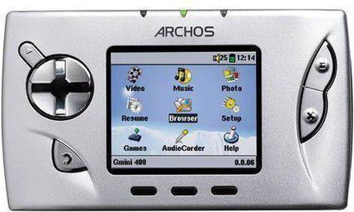
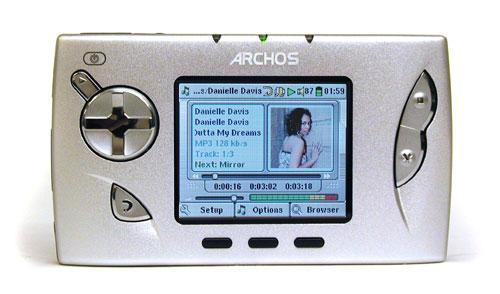
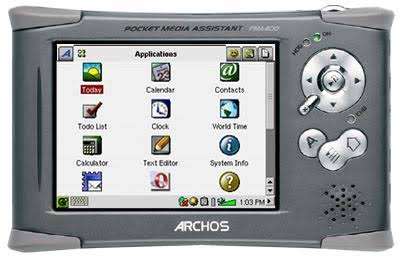
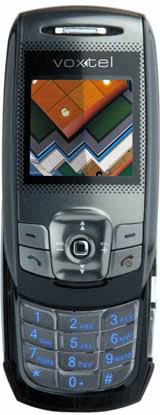
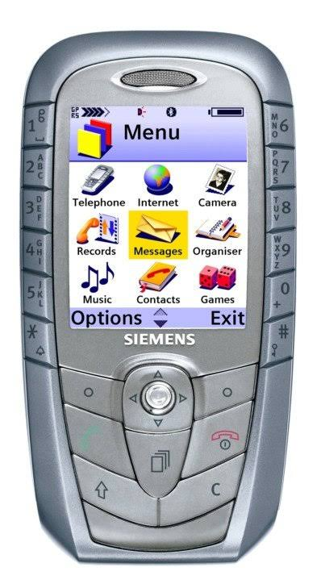
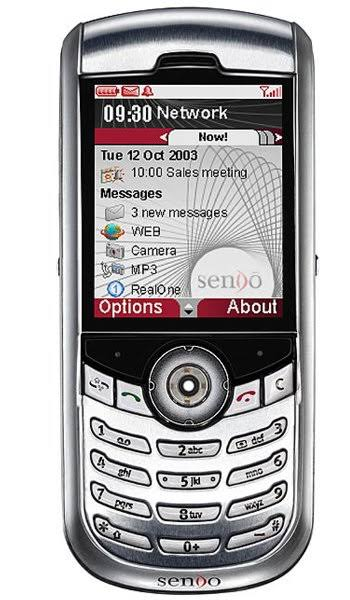

<b>GMINI_400</b>

The Gmini is a series of portable audio and video players released by Archos.

* <b>Release date</b>: August 31, 2004
* <b>Storage</b>: 20GB
* <b>Display</b>: 2.2 "LCD 220 x 176 pixels, 262,000 colors and TV output.

<b>GMINI_402</b>

— The player includes a built-in game engine, Mophun for 3D-style games.

* <b>Release date</b>: July 12, 2005

<b>AV700</b>

— The AV700 comes in 40, 80 or 100 gigabyte models. The built-in screen resolution is 420 by 234.

— The AV700 has a built-in Mophun gaming engine.

* <b>Release date</b>: May 23, 2005

<b>PMA400</b>

— The Archos PMA400 is a personal digital assistant (PDA) from Archos.

— Based on the Linux Qtopia Embedded operating system.

— Games using the Mophun engine

* <b>Release date</b>: January 2005
* <b>Storage</b>: 20/30GB
* <b>Display</b>: QVGA, touchscreen, LCD

<b>VS400</b>

— The phone supports both Java and Mophun. There is only one game in the Mophun folder, this is the Xfinity arcade game, which is well known to owners of Sony Ericsson phones. It was not possible to find any other games for this phone, on the official website of Mophun there was no mention of support for Voxtel devices, let's hope that this is temporary.

* <b>Release date</b>: October 2005

<b>SX1</b>

— The Siemens SX1 is a GSM mobile phone running version 1.2 of the Series 60 platform for the Symbian OS.
— Mophun 3D support
* <b>Release date</b>: Q3 2003
* <b>Storage</b>: 16MB
* <b>Display</b>: 176x220 (65,536 colours) TFT display
* <b>OS</b>: Symbian 6.1

<b>SendoX</b>

— The Sendo X was Sendo's first Series 60 based "high-end" phone, developed after Sendo switched from the Microsoft to Symbian / Series 60 platforms.

* <b>Release date</b>: Q4 2003
* <b>Storage</b>: 32MB
* <b>Display</b>: TFT, 65K colors with 176 x 220 pixels (2.2 inches, 35 x 44 mm)

<b>A920</b>

— Mophun 3D support

* <b>Release date</b>: 2003
* <b>Storage</b>: 8MB
* <b>Display</b>: TFT resistive touchscreen, 65K colors), 208 x 320 pixels, 3:2 ratio
* <b>OS</b>: Symbian 7.0, UIQ 2.0

<b>A925</b>

— Mophun 3D support

* <b>Release date</b>: Q4 2003
* <b>Storage</b>: 32MB
* <b>Display</b>: TFT LCD, touchscreen, handwriting recognition, 40 × 61 mm, 208 × 320 pixels, 16-bit color depth / 65536 colors
* <b>OS</b>: Symbian OS 7.0, UIQ 2.0

<b>A1000</b>

— Mophun support

* <b>Release date</b>: Q1 2004
* <b>Storage</b>: 24MB
* <b>Display</b>: TFT resistive touchscreen, 65K colors, 208 x 320 pixels, 3:2 ratio (~132 ppi density)
* <b>OS</b>: Symbian OS 7.0, UIQ 2.1

<b>N-Gage</b>

— Mophun pure support

* <b>Release date</b>: 4 February 2008 (pre-release)
3 April 2008 (full release)
* <b>Storage</b>: 3.4MB
* <b>Display</b>: Landscape or portrait 320 x 240 pixels (except N97, with a 640 x 360 pixels screen, graphics are stretched and displayed in a letterbox format to keep aspect ratio)
* <b>OS</b>: Symbian S60 3rd edition (S60 5th edition on N97)

<b>N-Gage QD</b>

— Mophun pure support

* <b>Release date</b>: May 2004
* <b>Storage</b>: 3.4MB
* <b>Display</b>: TFT, 4096 colors, 176 x 208 pixels (~130 ppi density)
* <b>OS</b>: Symbian 6.1, Series 60 1.0

<b>GameTrac Gizmondo</b>

— The Gizmondo is a handheld gaming console developed by Tiger Telematics. It was released in the UK, Sweden and the U.S

— UK-based Synergenix is provifing its Mophun "software-based gaming console for mobile devices".

— This collaboration is a furtherance to the previously announced October 13, 2003 partnership with Synergenix Interactive AB whose mophun(TM) enables Java gaming. Traditional HW graphics accelerator, support for 3D Mophun Mobile Gaming Technology.

* <b>Release date</b>: March 19, 2005
* <b>Storage</b>: 64MB
* <b>Display</b>: 72 mm (2.8 inch) TFT screen, 320 × 240 pixels
* <b>OS</b>: Windows CE

| Device | Models |
| ------ | ------ |
| Sony Ericsson | T68, T68i, T100, T226, T230, T237, T238, T290 (T290a, T290i, T290c), T300/R201, T302, T306, T310, T312, T316, T610 (T618 in China), T616, T618, T628, T630, T637, P800, P802, P900, P908, P910, Z208, Z300, Z600, Z608 |
| Nokia (Symbian S60/UIQ) | 3230, 3620, 3650, 3660, 6260, 6600, 6620, 6630, 6670, 6680, 6681, 6682, 7610, 7650, E60, E61, E70, N70, N71, N80, N-Gage*, N-Gage QD |
| Windows Mobile | All Windows Mobile Smartphones running at a resolution of 176x220 or 240x320 |
| Motorola | A920, A925, A1000 |
| Siemens | SX1 |
| Archos | Gmini 400, Gmini 402, PMA400, AV700 |
| Medion, PAVO, TTPCom | MD95674 |
| Sendo | SendoX |
| Tiger Telematics | GameTrac Gizmondo |
| Voxtel | VS400 |
| Other | further PDA with emulators (from personal experience of T-Mobile MDA) |

* Nokia N-Gage/QD doesn't support pure mophun, it's symbian after all. You probably meant that some games (such as Worms World Party) were written in Mophun, with libraries (such as Mophun.dll) added to them. But still, uploading a pure .mpn from Ensejż will not do much for you, because the game data is usually outside this file in separate folders, not in this file, as was the case with Sony Ericsson.
