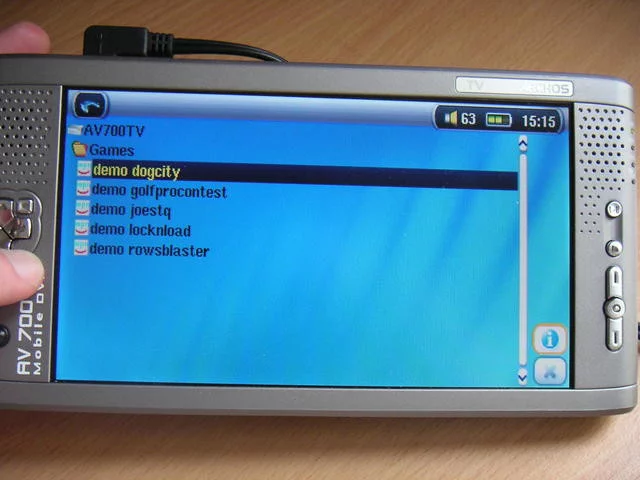
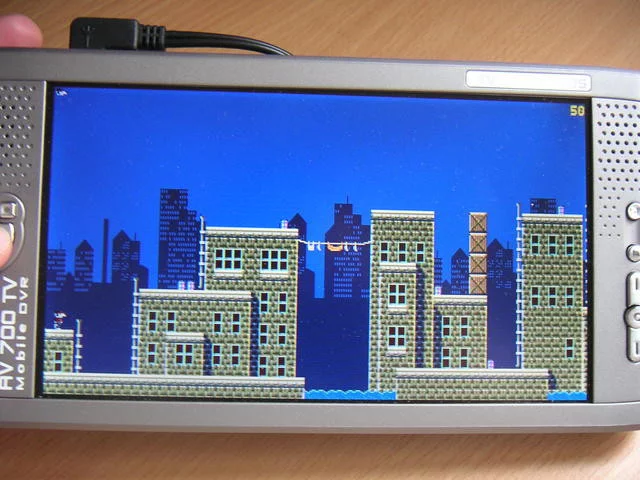
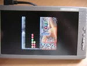
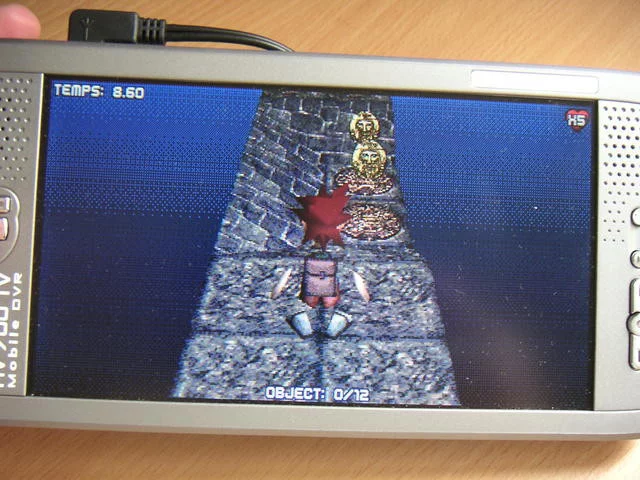
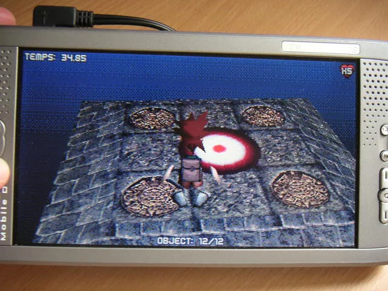
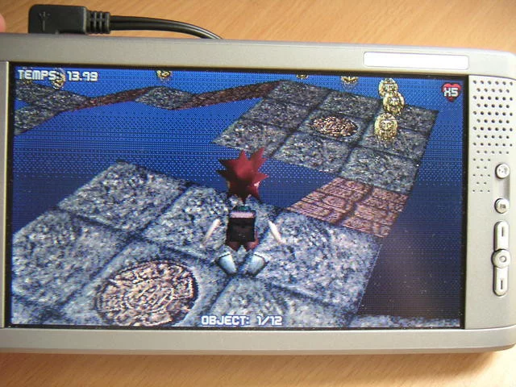
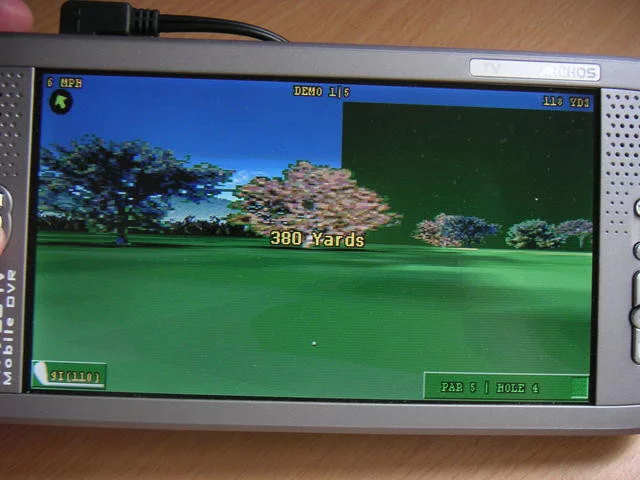
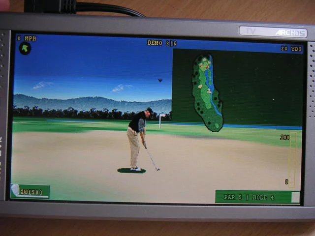
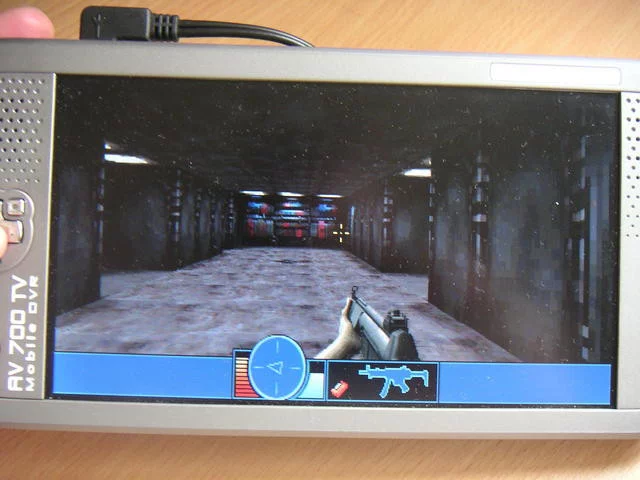
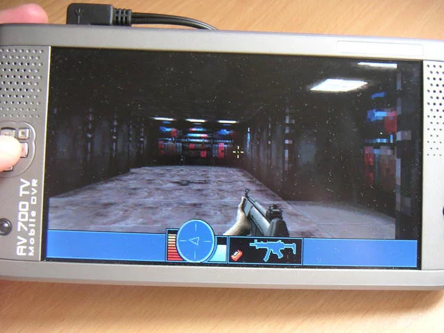

## AV700/700TV

* [AV700 mophun games store](https://web.archive.org/web/20080209035006/http://www.archos.com/store/wsearch.html?country=global&lang=en&prod_id=av700)

— The AV700TV comes with various Mophun demo version games designed for the terminal, some of them quite impressive 2D/3D graphically. The AV700TV only has a fairly "hard" Joypad to use, so the use of such games will a priori only remain an accessory function.

| L1 |
| --- |
| 

| Dog City | Raws Blaster |
| --- | --- |
|  |  |

| Joe’s Treasure Quest S1 | Joe’s Treasure Quest S2 | Joe’s Treasure Quest S3 |
| --- | --- | --- |
|  |  |  |

| Golf Pro Contest S1 | Golf Pro Contest S2 | Golf Pro Contest S3 |
| --- | --- | --- |
|  |  |  |

| Lock 'N load S1 | Lock 'N load S2 | Lock 'N load S3 |
| --- | --- | --- |
|  |  |  |
