<h1 align="center">
   
  <a href="#">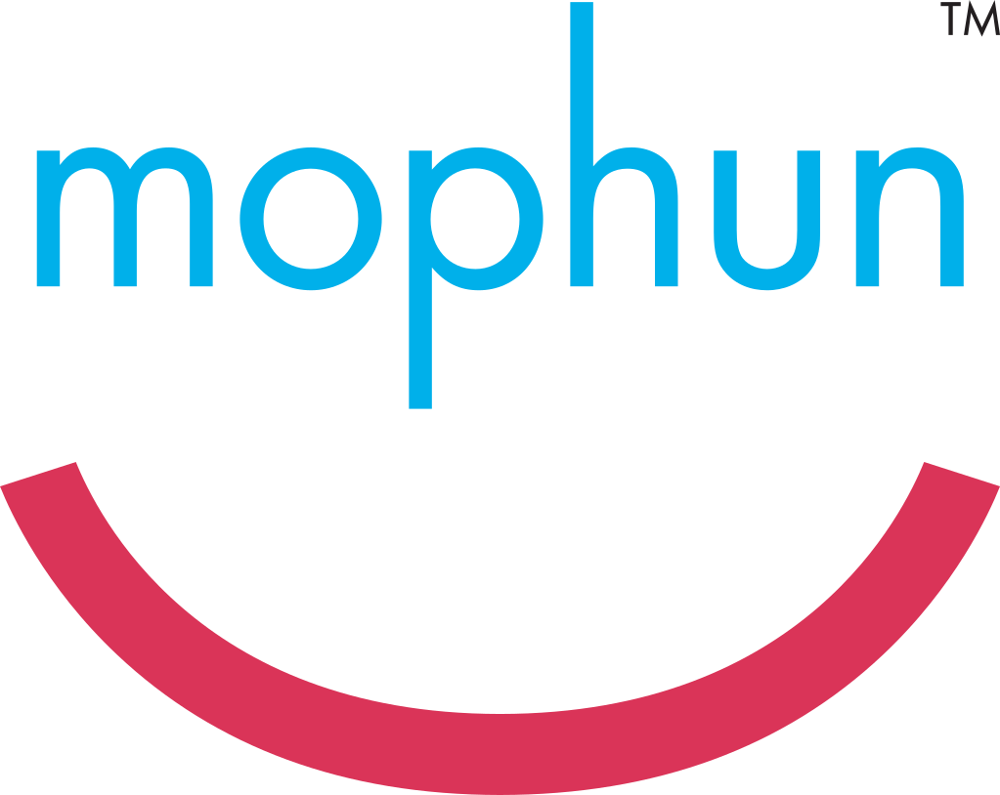</a>
   
  Mophun
   
</h1>
<i><h6 align="center"><b>Mophun</b> is a computing platform used to run portable code on embedded and mobile devices. It was designed by Synergenix Interactive. It develops games in the C and C++ programming languages</i></h6>

— <i>Mophun Supported devices check out <b>'[List of Mophun supported phones](https://github.com/ptnn0/Mophun/tree/main/List%20of%20Mophun%20supported%20phones)'</b></i>

##### Emulators
| Name  | Version    | Platform | Active |
| ---------- | ---------- | --------- | ------ |
| Mophun-mod | 2.5.4 Alpha 2   | Windows | Yes (tuxality-mod) |
| Mophun games launcher  | 1.01/unsigned | Symbian | No |
| 4mophun    | 1.1 | Windows Mobile | No |
| MoRePhun | POC | Windows | Yes |

**Mophun** is an official Mophun emulator. It was created by Synergenix Interactive, the creators of Mophun, for the Mophun SDK (latest version 2.5). It was designed for development and demos. As such, encrypted or compressed games do not boot. However, this has been worked around, both by decrypting the files and decompressing them (except for compressed resources), and modifying the emulator to perform decryption on the fly, albeit only when opening them via the Open menu. 

— Exile is not known to work in any found version of the emulator.

<b><i>Changelogs</b></i>

**2.5.4**
- Updated profile for Model 16 (Archos Gmini 400) including skin
- Data certificate bugfix for category 1 and 2 profiles (when using DataCertificateTestSuite for example)

**2.5.3**
- New profiles added for Symbian devices
- New preliminary profiles for unnamed jukeboxes (Model 14 & 16). No timing!
- Updates to the 3D API, see the SDK release notes
- 3D bugfix in P800/P900 profiles

**2.0.3**
- Make it possible to enable/disable onscreen joystick on P800/P900. All it does is change the screen size, it does not draw the panel.
- In models 1,2 and 5 (SonyEricsson T300 and T610 variants) use windows fonts as a fallback if a requested character does not exist in the SonyEricsson device font (i.e chinese).

**2.0.2**
- profile for GameTrac added (no timing yet)
- Added interpolation for 16bit

**2.0.1**
- Help file for emulator added

**2.0.0**
- S60 profiles split up into 7650, 3650 and N-Gage profiles
- Additional 3D features

<b><i>Compatibility</b></i>

* <b>General</b>

— Due to the nature of the emulator, encrypted or compressed games do not boot; commercial games are encrypted, and games not designed for Mophun-specific phones (e.g. Symbian, Windows Mobile) are also compressed. In some cases, resources are compressed separately to the program.

* <b>Specific games</b>

— The background is incorrectly drawn as a grey flat texture in Hitman, and The Da Vinci Code 3D (except 1.0.1, other versions require vMusicInit) doesn't work, which can be fixed using a special version of the emulator, which has referred to within the community as the Hitman emulator. Neither version boots Exile due to not supporting vMusicInit in 2.5.4, and vSin in the special version.

<b><i>Modification</b></i>

* <b>Game Expired</b>

— Some games give the message "Game Expired" at startup, which means that the game has expired. To play, you will have to change the date to the required one. You can find out with the [Date Mophun](https://github.com/ptnn0/Mophun/raw/main/Decrypt%20tools/DateMophun-eng.zip) program! Or open the *.mpn file with a text editor like editor or wordpad (on windows) and search for "00" until you find something like this " 20030417". That's the date you have to set your phone when you start the game, after the first succesfull start you can set your date to the old state.

— Use a HEX-editor like UltraEdit All you have to do, is search for the date (like 2004 or 2003 or so) in the ASCII part of the screen and change it to any year in the future.., like 2999. Save it, reload it in the phone, and voil? the game won't expire in your lifetime.

* <b>Mophun Decrypt</b>

— [Mophun Decrypt.exe](https://github.com/ptnn0/Mophun/raw/main/Decrypt%20tools/MophunDecrypt.exe) created by JaGoTu, allows for Mophun programs to be decrypted and, from Mophun Decrypt 2, decompressed.

* <b>Mophun Decrypt GUI</b>

— A GUI, [Mophun Decrypt GUI](https://github.com/ptnn0/Mophun/raw/main/Decrypt%20tools/MophunDecrypt_2.zip), created by childishbeat and written in Python, has been created to give the program a user interface. The latest version is 1.02, which predates Mophun Decrypt 2 and has not been updated to support decompression.

* <b>Mophun Decrypt GUI Changelogs</b>

— [1.02](https://github.com/ptnn0/Mophun/raw/main/Decrypt%20tools/MophunDecryptGUI_v1.02.7z) - Decreases .pyw size from 1,868 bytes to 1,713 bytes

— [1.01](https://github.com/ptnn0/Mophun/raw/main/Decrypt%20tools/MophunDecryptGUI_v1.01.7z) - Decreases .pyw size from 2,595 bytes to 1,868 bytes

— [1.0](https://github.com/ptnn0/Mophun/raw/main/Decrypt%20tools/MophunDecryptGUI_v1.0.7z) - Initial release

### Mophun-mod 
(Tuxality mod)
An unofficial mod, created by Tuxality, boots encrypted games without the need to decrypt them first by decrypting them on the fly.

<b><i>Changelogs</b></i>

**2.5.4 Alpha 2**
- Drag and drop support is added, minor issues are fixed (e.g. "Compressed MPN file is not supported yet!" is corrected to "Compressed MPN files are not supported yet!") and debug messages due to failure (decryption or source files) are implemented. Planned for the next version, A3 (alpha 3), are decompression, Symbian/Pocket PC key fallback and to run as early as Windows 98, just like the unmodified version.

**2.5.4 Alpha 1**
- Decryption only works if opening from the Open menu. However, compressed games are detected, but cannot run. Instead, an error saying "Compressed MPN file is not supported yet!" appears. Additionally, there may be some cases of crashing and the date, time, profile stuff is not properly set or selected

### Mophun Games Launcher
Only compatible with 14 games, all of which use the 3D engine and were released for Symbian. Russian-mod creted for N-series Edition (8.1 i.e. H70/72, N70.) and Synergenix Blaze-mod for N90 smartphone (displayresolution 352x416).

<b><i>Versions</b></i>

<i>BinPDA</i>

Updates:

— Added support for Symbian OS 9.2. 

— Added icons for games.

— Added item "About the game".

Installation:

1) Mophun Games Launcher 1.01.sis

2) GamesPack.sis

mpn-games should be placed in : /Data/MP/F0001092

* PS Not compatible with (sis) Mophun games, you must uninstall Mophun games before installing the emulator.

<b><i>Compatibility</b></i>

— Compatible with Symbian 9.1, 9.2

— The emulator should work fine on 3250, E60, 6290, N70, N73ME, N93.

<b><i>Included Games</b></i>

- Anarchy Boxing 3D 1.60
- Carmageddon 3D
- The Da Vinci Code 3D 1.0.2
- Fatal Arena 3D
- Football Pro Contest 1.0.4
- Golf Pro Contest 1 3D
- Golf Pro Contest 3D 2 1.0.1
- Heli Attack 2
- Joe’s Treasure Quest 3D
- Lock‘N Load Combat Arena 1.20.0
- Lock‘N Load Rise of War 1.01
- Lock‘N Load 2 1.1.0
- Martial Arts 3D 1.0
- Rally Pro Contest 3D 1.30
- Worms World Party (won't work with emulator installed)

<b><i>Features of the Games</b></i>

— Most 3D and Multiplayer supported with Bluetooth.

* 3D Graphics
* Multiplayer
* Sound Tuning
* 6680 Fix
* N90 Works
* Multi-Language Option (English, French, German, Italian, Spanish)

|  S1   |  S2  |
| --- | --- |
| <a href="#">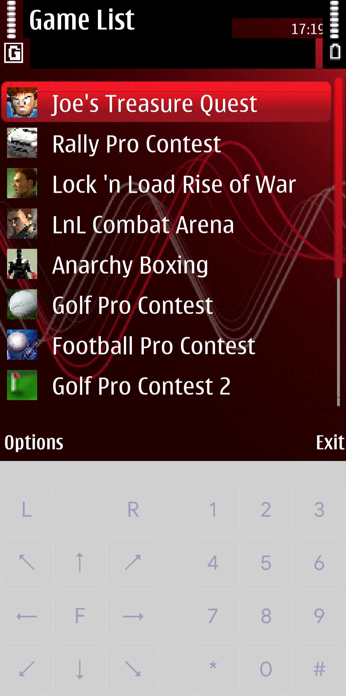</a> | <a href="#">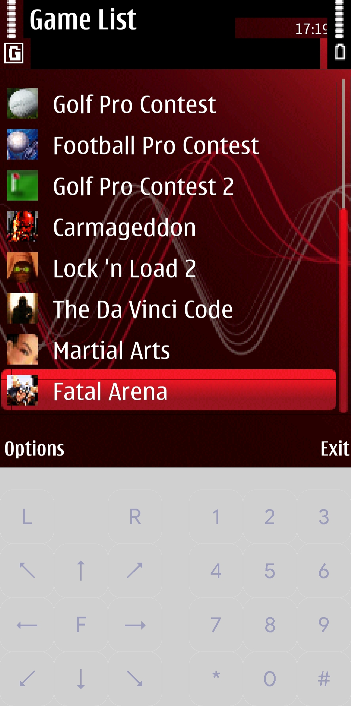</a> |

| <ins><b>★ Installation ★</ins></b> |
| ------------------------------------ |
| <b>Step 1</b>: <i>Install the <code>mophun_games_launcher.sis</code></i> | 
| <b>Step 2</b>: <i>Move/Extract the <code>mp/f0001092</code> folder to <code>com.github.eka2l1/files/data/drives/e/data/</code> Paste here.</i> |

### 4mophun 

<h1 align="center">
         
</h1>

**4mophun** on Windows Mobile, you can run 4mophun on Windows through Microsoft's Device Emulator. Does not work with games that are locked (e.g. have a predefined IMEI recognition algorithm) or do not use the 3D engine.

— There are 3 versions : QCIF +, QVGA [240x320] and VGA [176x220].

— The exe file exists in two versions, mophunVGA.exe and mophunQVGA.exe. The first one is used to emulate games on smartphones with a display resolution of 176x220, but it also works on PocketPCs with a VGA display. The second file is intended for all devices with QVGA display 240x320. Interestingly, each program emulates the game a little differently, for example, the classic mophun.exe can't play background music on some games (only sounds work), I also came across games that it couldn't run at all (Carmageddon), and its stability was about slightly worse than the QVGA version of the emulator, which handled all the titles tested.

— The emulator should work fine on all Smartphones and PocketPCs (e.g. Motorola MPx200 / 220, Qtek 8310, 8500, HTC MTeoR, HTC Typhoon [WM 2003 SE], Wizard, Universal or TyTN, ASUS P-750).

<i><b>Compatibility list</i></b>

| Name        | Code name     | Status |
| ----------- |:-------------:| -----:|
| American Racing 3D      |  |  |
| Anarchy Boxing 3D (available via Bluetooth)     | RealBoxing | Work |
| Carmageddon 3D (possible via Bluetooth)      | Carmageddon3D      |   Work |
| Da Vinci Code 3D | DVC      |    Work |
| Fatal Arena 3D | FA3D      |    Work |
| Football Pro Contest | FootballPro      |    Work |
| Golf Pro Contest | GolfProContest      |    Work with no sound + some backgrounds are 176x208|
| Golf Pro Contest 2 | GolfProContest2      |    Work with no sound |
| Heli Attack 2      |  |  |
| Joes Treasure Quest 3D      |  |  |
| Lock'N Load: Rise of War | LocknLoad      |    Work |
| Lock'N Load 2 (available via Bluetooth) | Exile      |    Work |
| Lock'N Load: Combat Arena (available via Wi-Fi or GPRS) | ArenaTMN      |    Work but only multiplayer |
| Martial Arts 3D | MA3D      |    Work |
| Rally Pro Contest (available via Bluetooth) | RallyProContest      |    Work |
| Worms World Party | WormsWWP      |    Not work with bad or missing certificate |

### Screenshots

| American Racing 3D | Anarchy Boxing 3D | Fatal Arena 3D |
| --- | --- | --- |
| 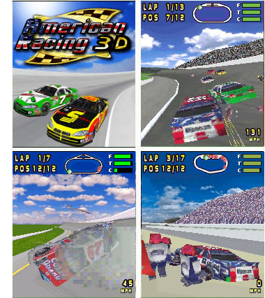 | 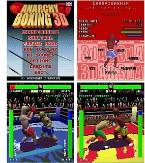 | 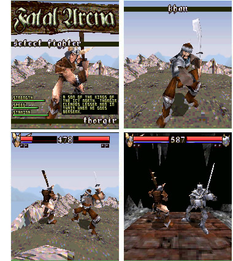 |

| Heli Attack 2 3D | Joe’s Treasure Quest 3D | Martial Arts 3D |
| --- | --- | --- |
| 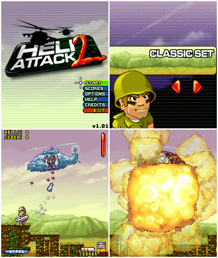 | 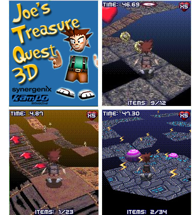 | 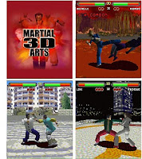 |

|      |      |       |
| ---- | ----- | ----- |
|  | 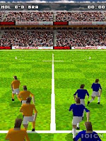 | 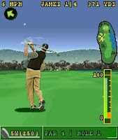 |
|  | 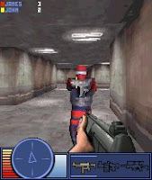 | 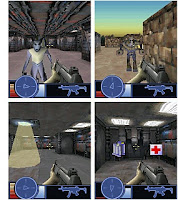 |
| 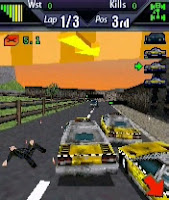 | 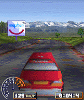 | 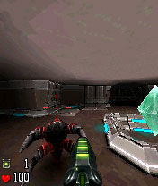 |
|  | 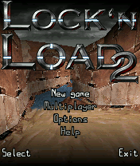 | 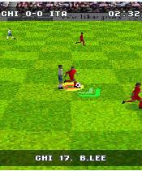 |
| 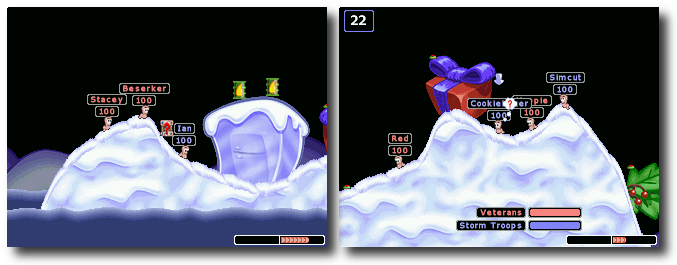 |  | 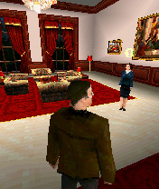 |
| 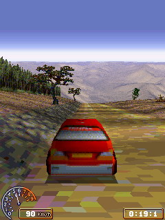 | 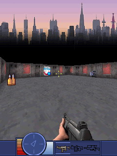 | 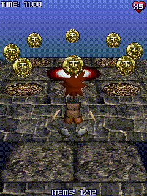 |
| 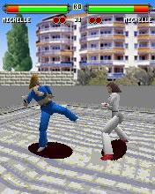 | 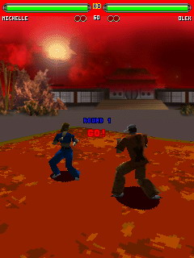 | 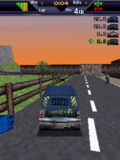 |
| 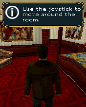 |  | 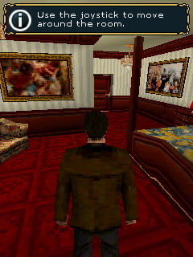 |
| 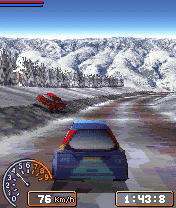 | 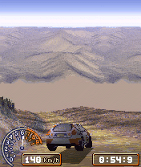 |
| 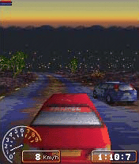 | 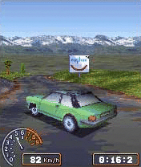 |

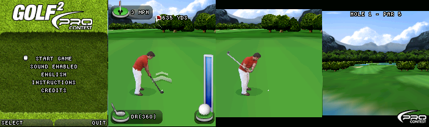
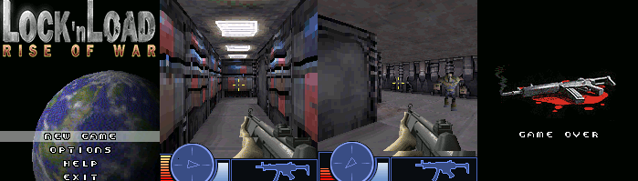
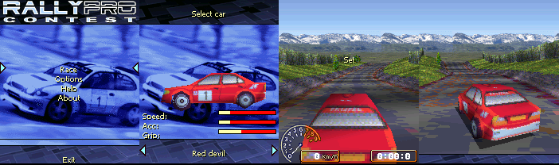
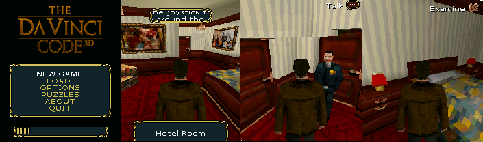

### MoRePhun
A new, open source emulator by Luca91. It is only a proof of concept, as only a few opcodes and a couple of SDK APIs are emulated, and there is no heap. There is sprite and input support, as well as support for the collision API. It is compatible with a few small homebrews. Luca91 mentions the SDK API handler needs to be better organized.

### Mophun SDK
Mophun was a mobile phone games SDK, it was released in 2002, C based SDK specialised to game development for mobile devices. It was made possible by Synergenix and it was coming with a free license to develop games. Mophun SDK allowed creation of games for the SymbianOS platform without the burned of the complexity of SymbianOS.

[Mophun SDK 2.5](http://tuxality.net/public/MophunSDK_2_5.zip) or [here](https://vetusware.com/download/Mophun%20SDK%202.5/?id=17165)

# Mophun 3D
— There are two versions of Mophun 2D and 3D, for low-end and high-end handsets and it's often used to provide embedded (pre-installed) games on mobile phone handsets.

— More information check out <b><i>'[Mophun 3D database](https://github.com/ptnn0/Mophun/tree/main/Mophun%203D%20database)'</b></i>, Newer Mophun 3D SDK unavailable. All 3D mophun games released for Symbian.

<b><i>Later 3D based mophun games</b></i>

- American Racing 3D
- Anarchy Boxing 3D
- Carmageddon 3D
- Conflict Desert Storm 3D (Unavailable)
- Conflict Global Storm 3D (Unavailable)
- The Da Vinci Code 3D
- Fatal Arena 3D
- Football Pro Contest 3D
- Golf Pro Contest 1 3D
- Golf Pro Contest 3D 2
- Heli Attack 2 3D
- Joe’s Treasure Quest 3D
- Lock‘N Load Combat Arena 3D
- Lock‘N Load Rise of War 3D
- Lock‘N Load 2 3D
- Martial Arts 3D
- Rally Pro Contest 3D
- Worms World Party

## Resources
* [Mophun games gameplay](https://youtube.com/playlist?list=PLq278TxO0xWUsEDsDLiC6TQvDwzGbjb5k)
* [Archos Gmini 402 support Mophun](https://youtube.com/watch?v=CdGAiMqbdtA)
* [Lessphun is an implementation of the Mophun API for Cibyl](https://github.com/SimonKagstrom/lessphun)
* [Mophun/code](https://github.com/SimonKagstrom/old-projects/tree/master/mophun)
