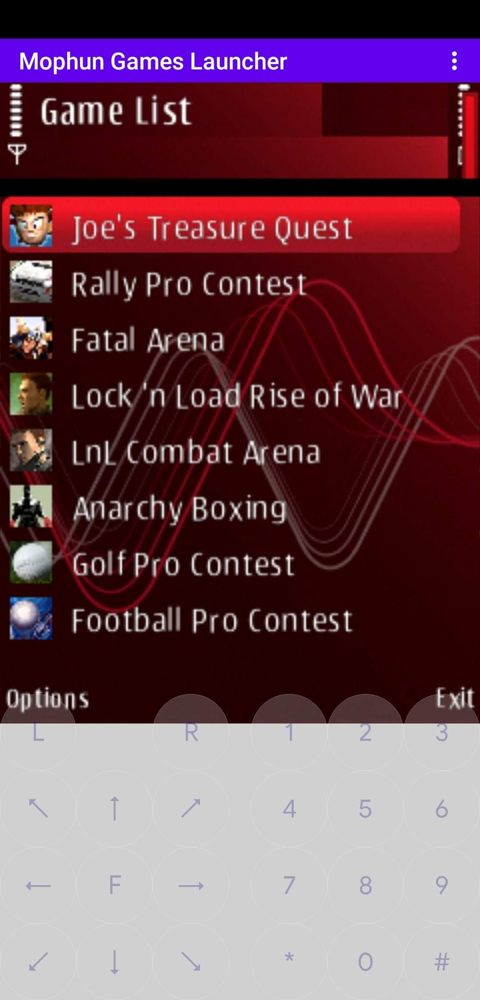
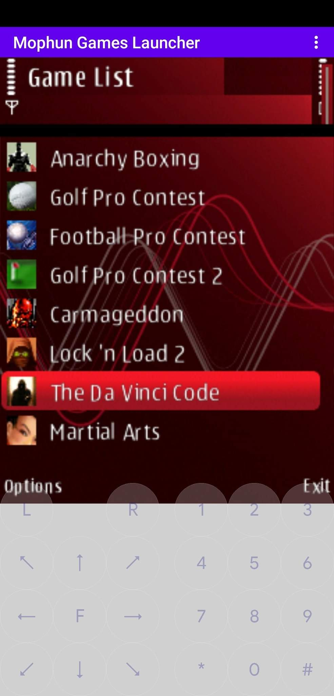
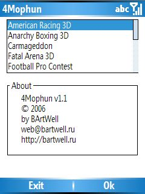

<h1 align="center">
         
</h1>

Some games give the message "Game Expired" at startup, which means that the game has expired. To play, you will have to change the date to the required one. You can find out with the Date Mophun program!
| Device | Models |
| ------ | ------ |
| Sony Ericsson | T68, T68i, T100, T226, T230, T237, T238, T290 (T290a, T290i, T290c), T300/R201, T302, T306, T310, T312, T316, T610 (T618 in China), T616, T618, T628, T630, T637, P800, P802, P900, P908, P910, Z208, Z300, Z600, Z608 |
| Symbian | S60v1, S60v2, S60v3, UIQ2, UIQ3.x
| Nokia | 3650, 6600, 7650, N-Gage |
| Windows Mobile |All Windows Mobile Smartphones running at a resolution of 176x220 or 240x320 |
| Motorola | A920 |
| Siemens | SX1 |
| Archos | Gmini 400, Gmini 402, PMA400, AV700 |
| Medion, PAVO, TTPCom | MD95674 |
| Voxtel | VS400 |
| Other | Pocket PC |

# Mophun

| Emulators                       | Version     | Platforms | Active |
| ------------------------------- | ---------- | -------------- | -------- |
| mophun-mod | 2.5.4 Alpha 2   |  | Yes (tuxality-mod) |
| 4mophun    | 1.1 |  | No |
| mophun games launcher  | 1.01/1.04 unsigned |  | No |

**mophun** is an official Mophun emulator. It was created by Synergenix Interactive, the creators of Mophun, for the Mophun SDK (latest version 2.5). It was designed for development and demos. There are two versions of Mophun, 2D and 3D, for low-end and high-end handsets, and it's often used to provide embedded (pre-installed) games on mobile phone handsets.

<b>Changelogs</b>

**2.5.4**
- Updated profile for Model 16 (Archos Gmini 400) including skin
- Data certificate bugfix for category 1 and 2 profiles (when using DataCertificateTestSuite for example)

**2.5.3**
- New profiles added for Symbian devices
- New preliminary profiles for unnamed jukeboxes (Model 14 & 16). No timing!
- Updates to the 3D API, see the SDK release notes
- 3D bugfix in P800/P900 profiles

**2.0.3**
- Make it possible to enable/disable onscreen joystick on P800/P900. All it does is change the screen size, it does not draw the panel.
- In models 1,2 and 5 (SonyEricsson T300 and T610 variants) use windows fonts as a fallback if a requested character does not exist in the SonyEricsson device font (i.e chinese).

**2.0.2**
- profile for GameTrac added (no timing yet)
- Added interpolation for 16bit

**2.0.1**
- Help file for emulator added

**2.0.0**
- S60 profiles split up into 7650, 3650 and N-Gage profiles
- Additional 3D features

# mophun-mod (Tuxality mod)
An unofficial mod, created by Tuxality, boots encrypted games without the need to decrypt them first by decrypting them on the fly.

<b>Changelogs</b>

**Alpha 2**
- Drag and drop support is added, minor issues are fixed (e.g. "Compressed MPN file is not supported yet!" is corrected to "Compressed MPN files are not supported yet!") and debug messages due to failure (decryption or source files) are implemented. Planned for the next version, A3 (alpha 3), are decompression, Symbian/Pocket PC key fallback and to run as early as Windows 98, just like the unmodified version.

**Alpha 1**
- Decryption only works if opening from the Open menu. However, compressed games are detected, but cannot run. Instead, an error saying "Compressed MPN file is not supported yet!" appears. Additionally, there may be some cases of crashing and the date, time, profile stuff is not properly set or selected

# Mophun Games Launcher
**Mophun Games Launcher** only compatible with 16 games, all of which use the 3D engine and were released for Symbian.

|  S1   |  S2  |
| --- | --- |
|  |  |

* First: install <code>mophun_games_launcher.sis</code>
* Second: run <code>GamePack.sis</code>

<code>EKA2L1/data/drives/e/data/mp/f0001092</code>
<pre>

* English [1.0/1.02/1.04 unsigned/BinPDA - 7/8/9 series]
* Russian [Blaze mod - N-series Edition]
* Chinese [S60V3]
</pre>

*Included games:*

- Anarchy Boxing 3D 1.60
- Carmageddon 3D
- Conflict Desert Storm (unavailable)
- Conflict Global Storm (unavailable)
- The Da Vinci Code 1.0.2
- Fatal Arena 3D
- Football Pro Contest 1.0.4
- Golf Pro Contest 1 3D
- Golf Pro Contest 3D 2 1.0.1
- Heli Attack 2
- Joe ’s Treasure Quest 3D
- Lock ‘n Load Combat Arena 1.20.0
- Lock ‘n Load Rise of War 1.01
- Lock ‘n Load 2 1.1.0
- Martial Arts 3D 1.0
- Rally Pro Contest 3D 1.30
- Worms World Party (Doesn't work)

# 4mophun 

<h1 align="center">
         
</h1>

**4mophun** on Windows Mobile, you can run 4mophun on Windows through Microsoft's Device Emulator. Does not work with games that are locked (e.g. have a predefined IMEI recognition algorithm) or do not use the 3D engine.

*Compatibility list:*

| Name        | Code name           | Status |
| ------------- |:-------------:| -----:|
| American Racing 3D      |  |  |
| Anarchy Boxing 3D      | RealBoxing | Work |
| Carmageddon 3D      | Carmageddon3D      |   Work |
| Conflict Desert Storm | |
| Conflict Global Storm | |
| Da Vinci Code | DVC      |    Work |
| Fatal Arena 3D | FA3D      |    Work |
| Football Pro Contest | FootballPro      |    Work |
| Golf Pro Contest | GolfProContest      |    Work with no sound + some backgrounds are 176x208|
| Golf Pro Contest 2 | GolfProContest2      |    Work with no sound |
| Heli Attack 2      |  |  |
| Joes Treasure Quest 3D      |  |  |
| Lock'n Load: Rise of War | LocknLoad      |    Work |
| Lock'n Load 2 | Exile      |    Work |
| Lock'n Load: Combat Arena | ArenaTMN      |    Work but only multiplayer |
| Martial Arts 3D | MA3D      |    Work |
| Rally Pro Contest | RallyProContest      |    Work |
| Worms World Party | WormsWWP      |    Not work with bad or missing certificate |

### Screenshots

|     |     |
| --- | --- |
|  |  |
|  |  |
|  |  |
|  |  |
|  |  |
|  |  |
|  |  |
|  |  |
|  |  |
|  |  |

### mophun SDK
Mophun was a mobile phone games SDK, it was released in 2002, C based SDK specialised to game development for mobile devices. It was made possible by Synergenix and it was coming with a free license to develop games.

[Mophun SDK 2.5](http://tuxality.net/public/MophunSDK_2_5.zip)
